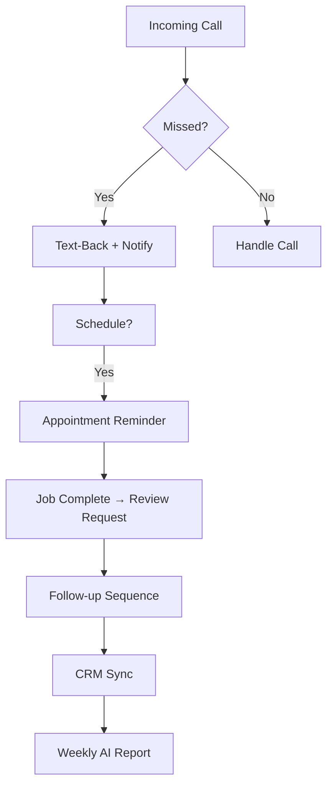

## Overview

EzBiz Services automates your entire front office so you focus on delivering great work. Key features handle missed calls, appointments, follow-ups, CRM syncing, and performance reports. Enable these tools in your dashboard to reduce lost revenue from unanswered calls and no-shows.

<Callout kind="tip">
Start by connecting your phone number in the dashboard. All features work together to capture every lead.
</Callout>

<Columns cols={3}>
  <Card title="Missed Call Handling" icon="phone" href="#missed-calls">
    Instant text-backs and notifications ensure no lead escapes.
  </Card>
  <Card title="Appointment Automation" icon="calendar" href="#appointments">
    Reminders and review requests keep your schedule full.
  </Card>
  <Card title="Follow-up Sequences" icon="message-circle" href="#follow-ups">
    Automated SMS nurtures leads into booked jobs.
  </Card>
  <Card title="CRM Integration" icon="database" href="#crm">
    Sync leads directly to your CRM for seamless tracking.
  </Card>
  <Card title="AI Reports" icon="bar-chart-3" href="#reports">
    Weekly insights show your automation ROI.
  </Card>
</Columns>

## Feature Flow

Understand how features connect with this simple workflow.



## Missed Calls Handling

When calls go unanswered, EzBiz sends instant SMS text-backs and notifies you via your preferred channel.

### Enable Missed Call Text-Back

<Steps>
  <Step title="Connect Phone Number" icon="phone">
    In your dashboard at `https://dashboard.ezbizservices.com/settings/phone`, add your business number.
  </Step>
  <Step title="Customize Message" icon="edit-3">
    Edit the default text: `Sorry we missed you! We'll call back shortly. Reply YES for a callback.`
  </Step>
  <Step title="Set Notifications" icon="bell">
    Choose SMS or email alerts with caller details.
  </Step>
</Steps>

<Callout kind="success">
You recover 62% more leads by responding within 5 minutes.
</Callout>

## Appointment Automation

Automate reminders to cut no-shows and request reviews post-job.

<Tabs>
  <Tab title="Reminders" icon="clock">
    Send SMS 24 hours and 1 hour before appointments.
    
    Example reminder:
    
````plaintext
Hi John, reminder for your plumbing service tomorrow at 2PM. Reply STOP to opt out.
````
  </Tab>
  <Tab title="Review Requests" icon="star">
    After job completion, request Google or Facebook reviews.
    
````plaintext
Thanks for choosing EzBiz Plumbing! How was your service? Rate us: [Google Review Link]
````
  </Tab>
</Tabs>

## Follow-up Sequences

Set up drip campaigns to convert inquiries into bookings.

<Expandable title="Example Sequence" default-open="true">
  Day 1: `Hi, following up on your plumbing quote.`
  
  Day 3: `Special offer: 10% off if booked this week.`
  
  Day 7: `Still need help? Reply SCHEDULE.`
</Expandable>

## CRM Integration

Push leads to your CRM via webhooks or Zapier.

<CodeGroup tabs="JavaScript,Python">
  ```javascript
  // Webhook handler example
  app.post('/ezbiz-webhook', (req, res) => {
    const lead = req.body;
    // Sync to your CRM
    await fetch('https://your-crm.com/api/leads', {
      method: 'POST',
      headers: { 'Authorization': 'Bearer YOUR_CRM_TOKEN' },
      body: JSON.stringify({
        name: lead.callerName,
        phone: lead.phone,
        service: lead.requestedService
      })
    });
    res.status(200).send('OK');
  });
  ```
  ```python
  # Webhook handler example
  from flask import Flask, request
  import requests

  app = Flask(__name__)

  @app.route('/ezbiz-webhook', methods=['POST'])
  def webhook():
      lead = request.json
      # Sync to CRM
      requests.post('https://your-crm.com/api/leads',
          headers={'Authorization': 'Bearer YOUR_CRM_TOKEN'},
          json={
              'name': lead['callerName'],
              'phone': lead['phone'],
              'service': lead['requestedService']
          })
      return 'OK', 200
  ```
</CodeGroup>

<ParamField path="leads" param-type="object" required="true">
  Incoming lead data from EzBiz webhook.
</ParamField>

<ResponseField name="callerName" field-type="string">
  Name from caller ID lookup.
</ResponseField>

## Weekly AI Reports

Get insights every Monday via email.

Reports include:
- Calls handled
- Appointments booked
- Revenue recovered

Customize in dashboard under `https://dashboard.ezbizservices.com/reports`.

<Callout kind="info">
Review reports weekly to optimize your sequences and recover more revenue.
</Callout>