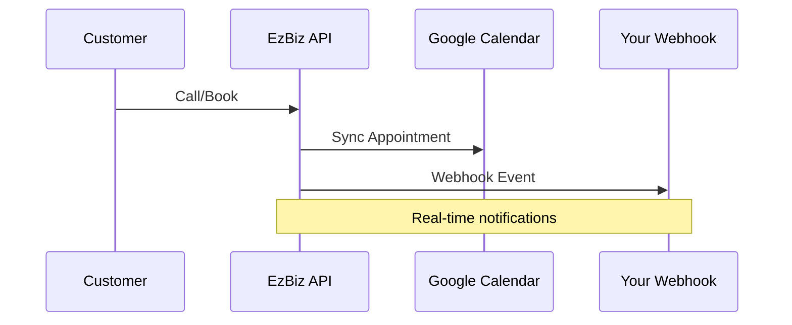

## Overview

EzBiz Services integrates seamlessly with popular tools to automate your front office. Set up AI-powered features for handling live calls, booking appointments, collecting reviews, and syncing calendars. Use webhooks for custom notifications. Pro and Scale plans unlock exclusive advanced automations.

<Callout kind="info" title="Plan Availability">
AI receptionist, advanced booking, and webhooks are exclusive to Pro and Scale plans. Upgrade via your dashboard at `https://dashboard.example.com/account`.
</Callout>

## Set Up AI Receptionist for Live Calls

Configure your AI receptionist to answer calls 24/7, qualify leads, and book appointments automatically.

<Steps>
  <Step title="Enable AI Receptionist" icon="phone">
    Navigate to `https://dashboard.example.com/settings/ai` and toggle on AI Receptionist.
  </Step>
  <Step title="Customize Greeting" icon="edit">
    Edit the greeting script. Use natural language like:
    
    ````javascript
    "Hi, thanks for calling EzBiz Services. How can I help with your plumbing needs today?"
    ````
  </Step>
  <Step title="Set Call Routing Rules" icon="settings">
    Define rules for transfers:
    
    | Rule Type | Action | Example |
    |-----------|--------|---------|
    | Emergency | Transfer to mobile | Keywords: "leak", "flood" |
    | Quote Request | Send SMS follow-up | Default handling |
    | Existing Customer | Check calendar |
    
  </Step>
  <Step title="Test the Setup" icon="play">
    Call your demo line at `(601) 552-5990` to verify.
  </Step>
</Steps>

## AI Appointment Booking Configuration

Tailor booking flows for Google Calendar, Outlook, or custom calendars.

<Tabs>
  <Tab title="Google Calendar" icon="calendar">
    Connect via OAuth in dashboard settings.
    
    <CodeGroup tabs="JavaScript,Python">
    ````javascript
    // Dashboard integration callback
    const googleAuthUrl = 'https://dashboard.example.com/integrations/google';
    window.location.href = googleAuthUrl;
    ````
    ````python
    # Server-side OAuth flow
    import requests
    auth_url = "https://accounts.google.com/o/oauth2/auth"
    params = {"client_id": "YOUR_CLIENT_ID", "redirect_uri": "https://dashboard.example.com/callback"}
    ````
    </CodeGroup>
  </Tab>
  <Tab title="Custom Calendar API" icon="api">
    Use our booking API endpoint.
    
    <ParamField path="date" param-type="string" required="true">
      ISO date for appointment (e.g., `2024-10-15`).
    </ParamField>
    
    <ParamField path="time" param-type="string" required="true">
      Time slot (e.g., `14:00`).
    </ParamField>
    
    <Request tabs="cURL,JavaScript">
    ````bash
    curl -X POST https://api.example.com/v1/bookings \
      -H "Authorization: Bearer YOUR_TOKEN" \
      -d '{"date": "2024-10-15", "time": "14:00", "customer": "+15551234567"}'
    ````
    ````javascript
    await fetch('https://api.example.com/v1/bookings', {
      method: 'POST',
      headers: { 'Authorization': 'Bearer YOUR_TOKEN' },
      body: JSON.stringify({ date: '2024-10-15', time: '14:00' })
    });
    ````
    </Request>
  </Tab>
</Tabs>

## Popular Integrations

Connect with essential tools using pre-built integrations.

<Columns cols={2}>
  <Card title="Google Reviews" icon="star" href="https://dashboard.example.com/integrations/reviews">
    Auto-prompt satisfied customers for 5-star reviews post-job.
  </Card>
  <Card title="Google Calendar Sync" icon="calendar" href="https://dashboard.example.com/integrations/calendar">
    Two-way sync for appointments and reminders.
  </Card>
  <Card title="Zapier" icon="zap" href="https://zapier.com/apps/ezbiz/integrations">
    No-code automations with 5000+ apps.
  </Card>
  <Card title="Slack Notifications" icon="message-circle" href="https://dashboard.example.com/integrations/slack">
    Real-time alerts for new leads and bookings.
  </Card>
</Columns>

## Webhook Setup for Custom Notifications

Receive real-time events like new calls or bookings at your endpoint.

<Expandable title="Webhook Payload Example" default-open="true">
  Events include `call.received`, `booking.created`.

  ```json
  {
    "event": "call.received",
    "data": {
      "caller": "+15551234567",
      "transcript": "Need plumbing quote for kitchen sink.",
      "timestamp": "2024-10-15T14:00:00Z"
    }
  }
  ```
</Expandable>

Set up your server to handle webhooks:

<CodeGroup tabs="Node.js,Python">
````javascript
// Node.js webhook handler
app.post('/webhook', express.json(), (req, res) => {
  if (req.body.event === 'call.received') {
    // Send SMS or create ticket
    console.log(req.body.data.transcript);
  }
  res.status(200).send('OK');
});
````
````python
# Python Flask webhook
from flask import Flask, request
app = Flask(__name__)

@app.route('/webhook', methods=['POST'])
def webhook():
    data = request.json
    if data['event'] == 'call.received':
        # Process lead
        print(data['data']['transcript'])
    return 'OK', 200
````
</CodeGroup>

Validate signatures using `X-Ezbiz-Signature` header with your webhook secret.

## Pro and Scale Plan Exclusives

Unlock enterprise features:

<Callout kind="tip">
- Custom IVR menus
- Multi-language AI support
- Advanced analytics dashboard
- Priority support (2-hour response)
</Callout>

<Expandable title="Migration Guide" default-open="false">
To upgrade:

1. Visit `https://dashboard.example.com/billing`.
2. Select Pro or Scale plan.
3. Features activate instantly.

Common migration issues:

| Issue | Solution |
|-------|----------|
| Calendar sync fails | Re-authorize OAuth |
| Webhook timeouts | Increase endpoint timeout to `>5s` |
</Expandable>

## Best Practices

- Test integrations in staging first.
- Use webhooks for critical automations over polling.
- Monitor dashboard analytics for integration health.



Next, explore [Quickstart](/quickstart) for basic setup or [Authentication](/authentication) for secure API access.